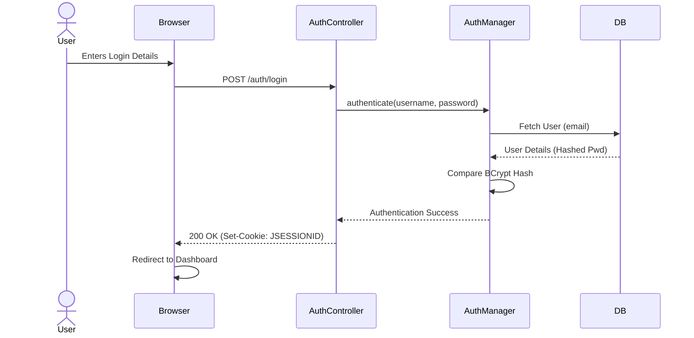
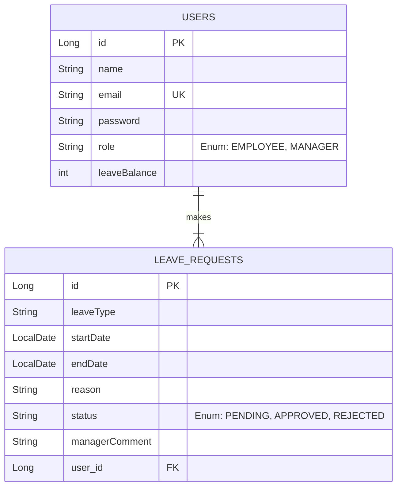

# Employee Leave Management System - System Design

## 1. System Overview

The **Employee Leave Management System (ELMS)** is a web-based application designed to streamline the process of leave management for organizations. It allows employees to request leaves, track their leave balance, and view their history. Managers can review, approve, or reject these requests.

## 2. Technology Stack

- **Frontend**: HTML5, CSS3, Vanilla JavaScript (No heavy frameworks, lightweight and fast).
- **Backend**: Spring Boot 3.x (Java 17).
- **Database**: MySQL (Relational Data Persistence).
- **Security**: Spring Security with HttpSession & BCrypt Password Hashing.
- **Build Tool**: Maven.

## 3. High-Level Architecture

The application follows a standard **Layered Architecture** pattern (Controller-Service-Repository).

```mermaid
graph TD
    Client[Client Browser\n(HTML/JS/CSS)] <-->|HTTP/REST JSON| Controller[Controller Layer\n(REST API)]
    Controller <--> Service[Service Layer\n(Business Logic)]
    Service <--> Repo[Repository Layer\n(Data Access/JPA)]
    Repo <--> DB[(MySQL Database)]

    subgraph "Backend (Spring Boot)"
    Controller
    Service
    Repo
    end
```

## 4. Key Components

### 4.1. Security Architecture

We use a **stateful session-based** security model using Spring Security's default `HttpSession`.

1.  **Authentication**:

    - User submits credentials via `/auth/login`.
    - `AuthController` delegates to `AuthenticationManager`.
    - `DaoAuthenticationProvider` checks DB using `CustomUserDetailsService`.
    - Password matches (BCrypt) -> Session created.
    - `JSESSIONID` cookie returned to client.

2.  **Authorization**:
    - `SecurityConfig` restricts endpoints.
    - `/admin/**` -> Requires `ROLE_MANAGER`.
    - `/api/**` -> Requires `Authenticated`.



## 5. Database Design (ER Diagram)

The database consists of two main entities: `User` and `LeaveRequest`. They share a **One-to-Many** relationship (One User can have multiple Leave Requests).



## 6. Directory Structure

Overview of the key project directories:

```
src/main/java/com/demo/employeeleavemangement/
├── config/              # SecurityConfig, etc.
├── ctrls/               # REST Controllers (AuthController, LeaveController)
├── model/               # JPA Entities (User, LeaveRequest)
├── repository/          # JPA Repositories
├── service/             # Service Interfaces
├── serviceImpl/         # Service Implementations (Business Logic)
└── exception/           # Global Exception Handling

src/main/resources/static/
├── css/                 # Stylesheets
├── js/                  # Frontend Logic (auth.js, dashboard.js)
├── *.html               # View Pages (index.html, dashboard.html)
```

## 7. API Endpoints Strategy

| Method | Endpoint                   | Description              | Access  |
| :----- | :------------------------- | :----------------------- | :------ |
| `POST` | `/auth/register`           | Register new user        | Public  |
| `POST` | `/auth/login`              | Login user               | Public  |
| `GET`  | `/api/leaves`              | Get my leaves            | User    |
| `POST` | `/api/leaves`              | Apply for leave          | User    |
| `GET`  | `/api/leaves/pending`      | Get all pending requests | Manager |
| `POST` | `/api/leaves/{id}/approve` | Approve/Reject leave     | Manager |
